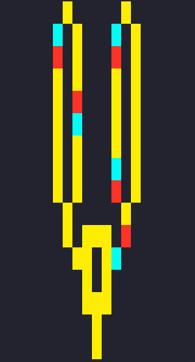

# Wireworld
*Wireworld* cellular automata console simulator.
The automata are encoded as text files with rectangular a grid of cells represented by:
* '.' - empty cell
* '#' - wire cell
* 'X' - electron head cell
* 'O' - electron tail cell

The console user interface allows for:
* creating new automata in a visual editor
* modyfying existing automata in said editor
* loading automata from file to simulate their behaviour

The program also finds cycle length of the automata, given it is shorter than 500 iterations.

### Simulation example
Two clock generators sending electrons into an XOR gate

